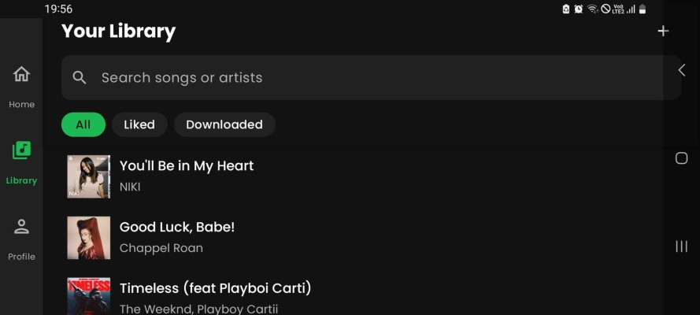

# Purrytify - Pengembangan Aplikasi Piranti Bergerak IF3210

## Deskripsi Aplikasi

Purrytify adalah aplikasi streaming musik yang dirancang untuk memberikan pengalaman mendengarkan yang kaya dan interaktif. Sebagai kelanjutan dari Milestone 1, versi ini memperkenalkan serangkaian fitur baru yang berfokus pada konektivitas online, analitik pengguna, dan kemampuan berbagi yang disempurnakan. Aplikasi ini memungkinkan pengguna untuk mendengarkan lagu dari penyimpanan lokal maupun lagu yang sedang tren secara online, mengelola pustaka mereka, dan mendapatkan rekomendasi musik yang dipersonalisasi.

Aplikasi ini dibuat untuk SDK minimum Android 10 (API Level 29) dan menargetkan SDK Android 14 (API Level 34).

Fitur utama dari aplikasi Purrytify meliputi:
* **Musik Online dan Offline**: Pengguna dapat melakukan streaming lagu-lagu yang sedang tren dari server, termasuk 50 lagu teratas global  dan 10 lagu teratas di negara tertentu. Lagu dari server juga dapat diunduh untuk didengarkan secara offline dan akan otomatis ditambahkan ke Library Offline.
* **Sound Capsule (Analitik Pengguna)**: Menyediakan analitik bulanan secara real-time mengenai kebiasaan mendengarkan pengguna, seperti total durasi mendengarkan musik, artis teratas, lagu teratas, dan day-streak. Data ini dapat dieksport ke dalam format file CSV atau PDF.
* **Pemutaran Latar Belakang & Kontrol Notifikasi**: Pemutar musik tetap berjalan di latar belakang, dengan mini player yang dapat dikontrol melalui notifikasi.
* **Peralihan Output Audio**: Aplikasi dapat mendeteksi dan mengganti output audio ke perangkat eksternal seperti speaker Bluetooth atau headphone.
* **Berbagi Lagu**: Lagu yang berasal dari server dapat dibagikan kepada pengguna lain melalui deep link (`purrytify://song/<song_id>`) atau kode QR yang dihasilkan. Membuka tautan atau memindai kode tersebut akan mengarahkan penerima ke halaman pemutar lagu di dalam aplikasi.
* **Edit Profil**: Pengguna dapat memperbarui profil mereka dengan mengubah foto profil (dari galeri atau kamera) dan lokasi mereka. Lokasi dapat dideteksi secara otomatis atau diatur manual menggunakan Google Maps Intent.
* **Rekomendasi Lagu**: Halaman utama menampilkan rekomendasi lagu yang dikurasi secara otomatis berdasarkan top global, country, dan lagu yang ada di lokal.
* **UI Responsif**: Setiap halaman dirancang agar responsif dan dapat digunakan dengan baik dalam orientasi portrait ataupun landscape.

## Library yang Digunakan

* **UI**:
    * Jetpack Compose
    * Material Design Components
* **Asynchronous**:
    * Kotlin Coroutines
* **Network**:
    * Retrofit 2
    * OkHttp 3
* **Media**:
    * ExoPlayer / Media3
* **Image**:
    * Coil / Glide
* **Database**:
    * Room
* **Dependency Injection**:
    * Hilt / Koin
* **Kode QR**:
    * ZXing
* **Pembuatan File**:
    * iTextPDF / Apache PDFBox
* **Manajemen Izin (Permissions)**:
    * Dexter / EasyPermissions

## Screenshot Aplikasi

**Contoh:**

Screenshot Home

Screenshot Library

Screenshot Profile
 

Screenshot Player
 

## Pembagian Kerja Anggota Kelompok dan Jam Pengerjaan
| No. | NIM | Nama | Kontribusi | Jam Persiapan & Pengerjaan |
| :-- | :-- | :--- | :----------- | :----------------------- |
| 1. | 13522011 | Dewantoro Triatmojo | Header dan Navbar, Library, Putar Lagu, Tambah Lagu, Profile, Liked Songs, Soundcapsule, Responsive, testing | 30 jam |
| 2. | 13522067 | Randy Verdian | Home, Lagu Online, Audio Routing, Responsive, Notification Control, Rekomendasi, testing | 30 jam |
| 3. | 13522089 | Abdul Rafi Radityo Hutomo | Background Process, Library, QR Share, URL Share, Edit Profile, Soundcapsule, Responsive, testing | 30 jam |